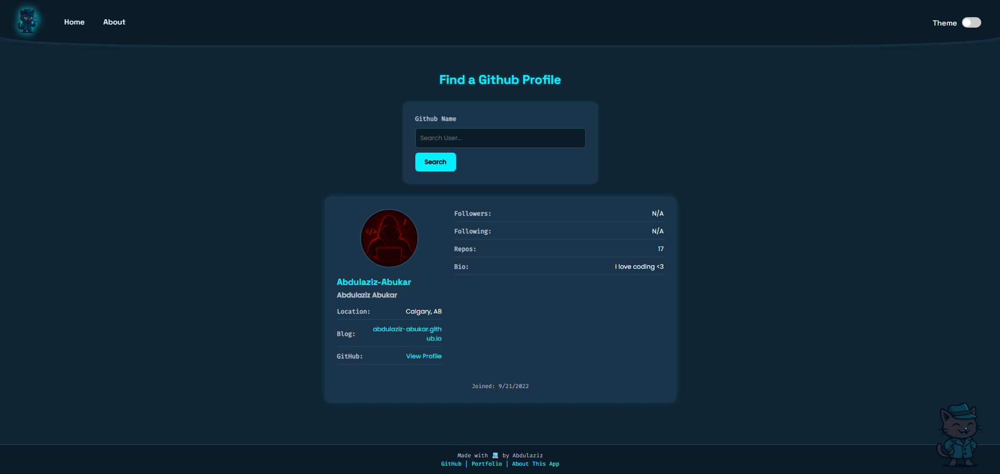

# 🧭 devFinder

A sleek, themeable GitHub profile lookup app built with React + Vite. Easily search for any developer by their GitHub username and get essential profile information with a modern UI and smooth UX.

---

## 🔍 Features

- 🔎 Live search for any GitHub user
- 👤 Displays avatar, name, username, bio, location, repo count, and followers
- 🌙 Dark/Light theme toggle with smooth animated transitions
- 🎨 Fully responsive layout using CSS Modules and custom properties
- 🧠 Clean, modular file structure for easy scalability
- 💾 Theme preference stored in `localStorage`
- 🚀 Built with Vite for ultra-fast development and builds
- 📦 Future enhancement: Show user’s most recent public repositories

---

## 🛠️ Tech Stack

- [React](https://reactjs.org/)
- [Vite](https://vitejs.dev/)
- [React Router](https://reactrouter.com/)
- [GitHub RestAPI](https://docs.github.com/en/rest?apiVersion=2022-11-28)

A sleek, themeable GitHub profile lookup app built with React + Vite. Easily search for any developer by their GitHub username and get essential profile information with a modern UI and smooth UX.

---

## 🔍 Features

- 🔎 Live search for any GitHub user
- 👤 Displays avatar, name, username, bio, location, repo count, and followers
- 🌙 Dark/Light theme toggle with smooth animated transitions
- 🎨 Fully responsive layout using CSS Modules and custom properties
- 🧠 Clean, modular file structure for easy scalability
- 💾 Theme preference stored in `localStorage`
- 🚀 Built with Vite for ultra-fast development and builds
- 📦 Future enhancement: Show user’s most recent public repositories

---

## 📸 Live Demo

> 🔗 [https://abdulaziz-abukar.github.io/devFinder](https://abdulaziz-abukar.github.io/devfinder)

---
